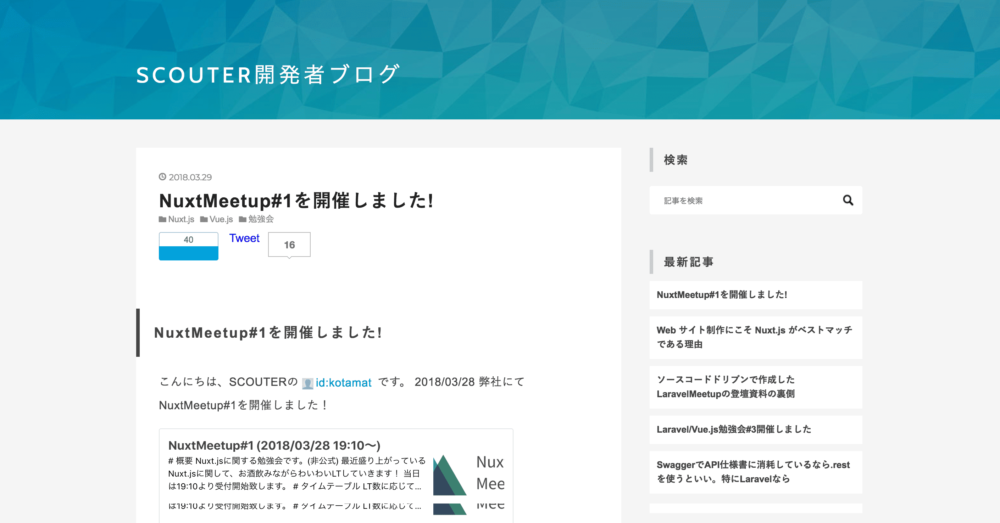

# AWSで構築するNuxt.jsのインフラ構築3選

---

## 自己紹介

- 株式会社SCOUTER CTO
- @kotamat
- 🚲

+++


+++

## 技術発信

- Laravue勉強会
- 技術ブログ
- NuxtMeetup

+++

### 技術ブログ



+++

- SCOUTERの技術発信
- 最近フロント多め
- Laravelやイベントレポートなどなど

+++

### NuxtMeetup


- Nuxt.jsに関するMeetup
- お酒飲みながらLTする会
- 次回は5/23に開催@メルペイ
- 参加者は110名ほど

---

## SCOUTERとは


---

## SCOUTER内での技術スタック

- 基本的に全てLaravel + Vue.jsの構成
- インフラはAWS
- 最近リリースしているプロダクトは、基本的にNuxt.jsを使用

+++

## Nuxt.js

Vue.jsのいろんなTipsを凝縮したフレームワーク

- VueRouter
- SSR
- Vuex
- VueMeta
- webpack
- babel

+++

## Nuxt.jsを使用しているプロダクト

+++


コーポレートサイト

+++


サービスLP

+++


オウンドメディア

---

## AWSで構築するNuxt.jsのインフラ構築

- 今Nuxt.jsが熱い！
- Nuxt.jsの良さの記事は多いけど、インフラの話は少ない
- インフラ工夫したので、紹介します
- ちゃんとLaravelもいれた構成も説明するよ 😅

---

## トピック

- Laravel + Nuxt generate
- Wordpress + Nuxt ssr
- Nuxt SSR + Express

---

## Laravel + Nuxt generate

+++

### 基本スタンス

- LaravelとNuxtを一緒のリポジトリに置く
- nuxt.config.jsの設定を調整
- TravisでNuxtGenerateする
- dist込みの全体をCodedeployで設置
- Nginxでリバプロする
- (補足)ビルド時にチェックしておくべきポイント

+++

### LaravelとNuxtを一緒のリポジトリに置く

```bash
app/
bootstrap/
config/
...
client/←追加
nuxt.config.js←追加
package.json←そのまま 
```

+++

### nuxt.config.jsの設定を調整

+++?code=src/laravel/nuxt.config.js&lang=js&title=nuxt.config.js

`client/` を認識するように設定を追加

+++

### TravisでNuxtGenerateする

+++?code=src/laravel/.travis.yml&lang=yml&title=.travis.yml

@[1-3](依存パッケージのinstall)
@[4-5](先にgenerate)
@[6-9](不要なディレクトリを除いてzip化)
@[11-20](S3に上げる)

+++

### dist込みの全体をCodedeployで設置

+++?code=src/laravel/.travis.yml&lang=yml&title=.travis.yml

@[21-31](S3からcodedeployに投げる)

+++?code=src/laravel/appspec.yml&lang=yml&title=appspec.yml

@[3-5](普通に設置する)

+++

### Nginxでリバプロする

+++?code=src/laravel/app.conf.nginx&lang=nginx&title=nginx.conf

@[4,17](ディレクトリで分岐)
@[17-22](Generateしているファイルは普通にtry_filesで引っかかる)
@[4-16](/apiになっているものはLaravel側を参照しにいく)

+++

### (補足)ビルド時にチェックしておくべきポイント

+++?code=src/laravel/.travis.yml&lang=yml&title=.travis.yml

@[1-31](`nuxt` コマンドで生成するときと`nuxt generate`する時で、ビルドのフローが異なっているので、)
@[4-5](CI側では`nuxt generate`が失敗しないこともチェックする必要がある)

---

## Wordpress + nuxt ssr

- WordpressAPIを使用。
- 大体この手のアプリはSEO対策が必須になるのでSSRモードにする
- プロセス監視にはforeverを使用

+++

### サマリ

- Nuxtのみのリポジトリを設置する
- Travisでnuxt build
- Codedeployで設置
- foreverのプロセスを切る

+++

### Nuxtのみのリポジトリを設置する

- Wordpress APIを使用
- Specが決まってるので、Wordpressと共存する必要がない
- 普通に単一リポジトリにVue cliでインストール

+++?code=src/wp/nuxt.config.js&lang=js&title=nuxt.config.js

@[4-6](axios moduleを使う)
@[7-9](baseURLをwp用に設定)

+++

### Travisでnuxt build

+++?code=src/wp/.travis.yml&lang=yml&title=.travis.yml

@[1-2](依存パッケージのinstall)
@[5-8](不要なディレクトリを除いてzip化)
@[10-19](S3に上げる)

+++

### Codedeployで設置

+++?code=src/wp/.travis.yml&lang=yml&title=.travis.yml

@[21-31](S3からcodedeployに投げる)

+++?code=src/wp/appspec.yml&lang=yml&title=appspec.yml

@[3-5](普通に設置する)

+++

### foreverの対象プロセスを切って再起動

- ファイルを上げただけでは前のプロセスが残ってるので、デプロイにはならない
- foreverはプロセスを監視し、切れたタイミングで再起動を自動で行ってくれる
- 何か知らの方法でプロセスを切るか、`forever restart`で再起動をすることで、デプロイが完了する

+++?code=src/wp/appspec.yml&lang=yml&title=appspec.yml

@[22-27](起動設定ファイルを設置)

+++?code=src/wp/application_start.sh&lang=bash&title=application_start.sh

再起動のスクリプトを記述

---

## expressで構築する場合

- 独自のSlack通知やファイルアップロード等サーバーが必要な場合はExpressを使う
- デフォルトの`nuxt` `nuxt start`は使えなくなるので独自実装が必要
- やり方はNuxt.jsのドキュメントに記載されている [ドキュメントはこちら](https://nuxtjs.org/examples/auth-routes#using-express-and-sessions)

+++

### サマリ

- サーバーサイド用のjsファイルを作成
- developmentビルドとprodビルドで分ける
- 起動設定を対象jsファイルに向ける

+++

### サーバーサイド用のjsファイルを作成

+++?code=src/express/server.js&lang=js&title=server.js

@[1-4](nuxtやexpress等必要なものをrequire)
@[6-15](expressの設定を記述)
@[18-30](postなどのエンドポイントを記述)
@[33,36](prod判定をして)
@[34,37-38](developmentであれば、buildもおこなう)
@[40](start用の設定を注入)
@[41](ポートを開ける)

+++

### 起動設定を対象jsファイルに向ける

+++?code=src/express/application_start.sh&lang=bash&title=application_start.sh

再起動のスクリプトをserver.jsに向ける

---

## まとめ

- Nuxt.jsはいろんなパターンの配信方法がある
- 各々のインフラ構成を知っておけば、武器が増える
- みんなNuxt.js使っていこう！
- Laravelもね
